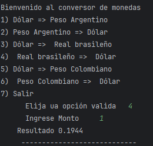

# Encriptador del curso de Alura BackEnd 2024

En este emocionante desafío de programación, construir tu propio Conversor de Monedas. Aprenderás a realizar solicitudes a una API de tasas de cambio, a manipular datos JSON y, finalmente, a filtrar y mostrar las monedas de interés. ¡Prepárate para una experiencia práctica y emocionante en el desarrollo Java!

### Los pasos para completar este desafío :

* Configuración del Ambiente Java
* Creación del Proyecto 
* Consumo de la API
* Análisis de la Respuesta JSON
* Filtro de Monedas
* Exibición de Resultados a los usuarios

 

 

### Futuras mejoras :

* **Historial de Conversiones**: Agrega la capacidad de rastrear y mostrar el historial de las últimas conversiones realizadas, brindando a los usuarios una visión completa de sus actividades.
* **Soporte para Más Monedas**: Amplía la lista de monedas disponibles para la elección, permitiendo a los usuarios convertir entre una variedad aún mayor de opciones monetarias.
* **Registros con Marca de Tiempo**: Utiliza las funciones de la biblioteca java.time para crear registros que registren las conversiones realizadas, incluyendo información sobre qué monedas se convirtieron y en qué momento.

### Se uso la Api de https://www.exchangerate-api.com/
#### Posibles alternativas
* Open Exchange Rates - https://openexchangerates.org/
* CoinGecko API -https://www.coingecko.com/api

